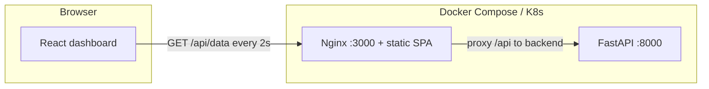

# Live Campus Digital Twin Dashboard with DevOps Automation

## Project overview

This project is a **full-stack demo** of a live campus “digital twin” dashboard. A **FastAPI** backend simulates telemetry (temperature, occupancy, energy, alert level) on `GET /data`. A **React** dashboard polls that endpoint every **2 seconds**, shows color-coded alerts, and plots recent samples with **Chart.js**. **Docker** and **Docker Compose** run the stack locally. **Kubernetes** manifests provide a cluster deployment path, **GitHub Actions** builds images in CI, **Terraform** can provision an **EC2 t2.micro** in **ap-south-1**, and **Ansible** can install **Docker** on that instance.

## Architecture



- **Why `/api`?** The browser cannot resolve Docker/Kubernetes internal DNS names like `backend`. The frontend is built to call **`/api/data`**. **Nginx** in the frontend container proxies `/api/` to the backend service (`http://backend:8000/`), so the browser only talks to the same origin (e.g. `http://localhost:3000`), and the backend is reached **by service name inside the container network**, not `localhost`.

## Repository layout

```text
digital-twin-devops/
├── backend/                 # FastAPI app + pytest suite
├── frontend/                # React (Vite) + Chart.js + nginx
├── docs/screenshots/        # Screenshot placeholders (see README inside)
├── scripts/                 # Optional compose helpers (PowerShell + bash)
├── docker-compose.yml
├── Makefile                 # Unix/macOS shortcuts (compose, pytest, k8s)
├── k8s/
├── terraform/
├── ansible/
├── .github/workflows/
├── .github/dependabot.yml
├── LICENSE
└── README.md
```

## Setup — local (Python + Node)

### Backend

```bash
cd backend
python -m venv .venv
.venv\Scripts\activate          # Windows
pip install -r requirements.txt
uvicorn main:app --reload --host 0.0.0.0 --port 8000
```

### Frontend

```bash
cd frontend
npm install
npm run dev
```

Open the Vite URL (e.g. `http://localhost:5173`). The dev server **proxies** `/api` to `http://127.0.0.1:8000`, so `/api/data` maps to backend `/data`.

**Node version:** **`frontend/.nvmrc`** pins Node **20** (optional; use `nvm use` if you use nvm).

### Backend tests

```bash
cd backend
pip install -r requirements-dev.txt
python -m pytest
```

Or from the repo root (requires `make`): `make test-backend`.

## Setup — Docker Compose

Requires **Docker Compose v2** (supports `depends_on: condition: service_healthy`).

From the repo root:

```bash
docker compose build
docker compose up -d
```

- Project name: **`digital-twin-devops`** (set in **`docker-compose.yml`**) so networks and containers are predictable.
- Services share an explicit bridge network **`campus`**; the frontend resolves the API at hostname **`backend`** (Compose DNS).
- Dashboard: **http://localhost:3000**
- API (direct): **http://localhost:8000/data**

The UI uses **http://localhost:3000/api/data** (proxied by nginx to the backend service).

Compose **healthchecks** wait until the API responds on `/health` before starting the frontend; backend checks use a **5s** `urlopen` timeout so slow starts do not hang forever.

**Verify integration** (after `up -d`):

- PowerShell: **`powershell -File scripts/verify-compose.ps1`**
- Bash: **`bash scripts/verify-compose.sh`**

## CI/CD

This repository is configured with a full CI/CD pipeline using GitHub Actions. On every push to the `main` branch, the following occurs:
1. Backend tests are run.
2. Docker images for the frontend and backend are built and pushed to Docker Hub.
3. The application is deployed to a Kubernetes cluster.

Quick start: **`scripts/compose-up.ps1`** (Windows) or **`scripts/compose-up.sh`** (Git Bash / Linux / macOS).

If the frontend stays in **“Waiting”**, ensure Compose v2 is current and wait for the backend **`start_period`** (40s on first boot); run **`docker compose ps`** and **`docker compose logs backend`**.

## Screenshots

See **`docs/screenshots/README.md`** for filenames and ideas. Example:

| File | Description |
|------|-------------|
| `docs/screenshots/dashboard.png` | Dark dashboard with metrics and chart |
| `docs/screenshots/docker-compose.png` | `docker compose ps` or running containers |

## CI/CD (GitHub Actions)

Workflow: **`.github/workflows/ci-cd.yml`**

1. **Checkout** the repository.
2. **Python 3.12:** install **`backend/requirements-dev.txt`** and run **`pytest`** (`test-backend` job).
3. **Docker Buildx** for caching (runs after tests pass).
4. **Build** backend and frontend images (`digital-twin-devops-backend:ci`, `digital-twin-devops-frontend:ci`) with **push: false** for safe CI on forks.

**Dependabot:** **`.github/dependabot.yml`** opens weekly update PRs for **pip** (backend), **npm** (frontend), and **GitHub Actions**.

To **push to Docker Hub** on `main`, add repository secrets `DOCKERHUB_USERNAME` and `DOCKERHUB_TOKEN`, then uncomment and adjust the optional push block at the bottom of the workflow file (see inline comments).

## Kubernetes deployment

Files in **`k8s/`** — see **`k8s/README.md`** for **`kubectl apply -k .`** (namespace **`campus-digital-twin`**) vs applying YAML files individually.

| File | Purpose |
|------|---------|
| `namespace.yaml` | Namespace **`campus-digital-twin`** |
| `kustomization.yaml` | Kustomize bundle (sets namespace for workloads) |
| `backend-deployment.yaml` | **2 replicas** of the API |
| `backend-service.yaml` | **NodePort** `30800` → port 8000 |
| `frontend-deployment.yaml` | Single replica of nginx + static UI |
| `frontend-service.yaml` | **NodePort** `30080` → port 3000 |

**Load images into your cluster** (example with minikube):

```bash
docker compose build
# Image names match folder-based compose project name, e.g. digital-twin-devops-backend:latest
minikube image load digital-twin-devops-backend:latest
minikube image load digital-twin-devops-frontend:latest
kubectl apply -f k8s/
```

The frontend nginx config uses upstream host **`backend`** (Kubernetes **Service** name), matching **`backend-service.yaml`** (`metadata.name: backend`).

Access via a node IP and NodePort, e.g. `http://<node-ip>:30080`.

## Terraform (AWS EC2)

Directory: **`terraform/`**

- **Region:** `ap-south-1` (default in `variables.tf`)
- **Instance:** `t2.micro`
- **Tag:** `Name = DevOpsProject` on the instance and security group

```bash
cd terraform
terraform init
# Optional: copy terraform.tfvars.example to terraform.tfvars and set region / SSH CIDR / key_name
terraform apply
```

Outputs (`instance_id`, `public_ip`) are defined in **`terraform/outputs.tf`**. Optional variables: `ssh_ingress_cidr` (default open — **restrict in production**), `key_name` (EC2 key pair for SSH). See **`terraform/terraform.tfvars.example`**.

## Ansible

**`ansible/playbook.yml`** installs Docker on Amazon Linux 2023 targets.

1. Copy **`ansible/inventory.ini.example`** to **`ansible/inventory.ini`** and set the Terraform **public IP** and SSH key path.
2. Run (uses **`ansible/ansible.cfg`** if run from the `ansible/` directory):

```bash
cd ansible
ansible-playbook -i inventory.ini playbook.yml
```

## Alert colors (UI)

| Alert | Color |
|-------|--------|
| Normal | Green |
| Warning | Yellow |
| Critical | Red |

## License

This project is released under the **MIT License** — see **[LICENSE](LICENSE)**.
